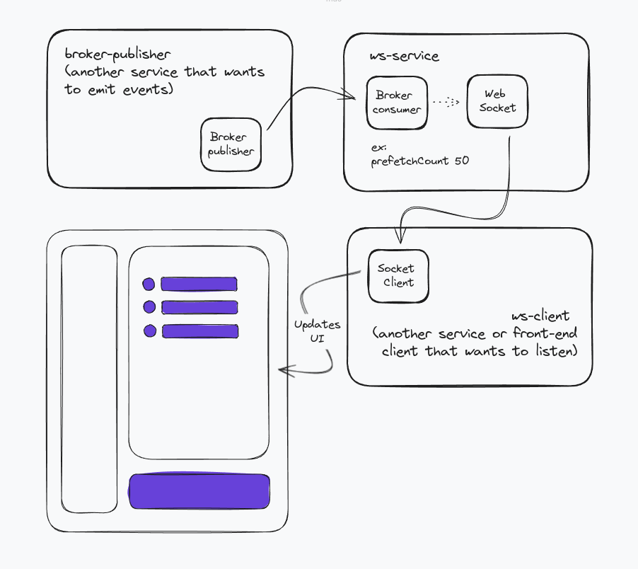

# Overview

This a proof of concept to escalate websockets application with messaging broker.

It is divided in 3 core application as below:

- ws-service: service that has a messaging broker consumer that listens to a queue to send a custom socket event according to necessity
- ws-client: service that has a socket client to listen to socket events emitted by ws-service throught the socket channel
- broker-publisher: service that is emitting events through a messaging broker publisher

Any another service can connect to ws-service through messaging HOST URL to send real time messages in socket as broker publisher (rabbitMQ chosen here).

**Why not sending events directly through a socket channel?**

Multiple simultaneous events can be harsh to a server, so a messaging broker helps to escalate for a large amount of connected clients.

## Architecture



## Installing

> It's recommended to use node version > v16.x

1. Install dependencies

```
cd ws-service && npm install && cd ../ws-client && npm install && cd ../broker-publisher && npm install
```

2. Run docker-compose

```
docker-compose up -d --build
```

3. Open 3 terminals

Run `npm run start` in each folder

## Observations

Publisher sending payload must follow types as below:

```
.ts file

interface PublishPayloadOptions {
  socketChannel: string;
  data: any;
}

JSON.stringify({
    socketChannel: 'socket:channel_name',
    data: { message: 'Message sent by broker-publisher' },
})
```
